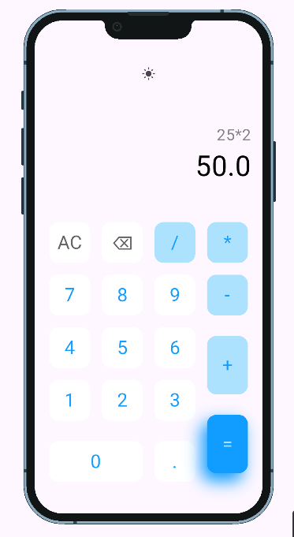
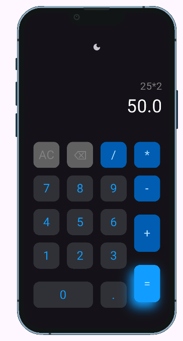

# 🔢 Flutter Calculator App

A simple and elegant calculator app built using **Flutter**, supporting light and dark themes.  
Designed with custom UI components and smooth interaction using `InkWell`.

---
## ✨ Features

- Basic arithmetic operations: `+`, `-`, `×`, `/`
- Clean, custom UI design using Flutter widgets
- Light and Dark mode support
---

## 📸 Screenshots

### ☀️ Light Mode
<a href="ScreenShots/Light_Mode_Calculator.png">
  
</a>

### 🌙 Dark Mode
<a href="ScreenShots/Dark_Mode_Calculator.png">
  
</a>

---

## 🚀 Getting Started

To run the project locally:

1. Clone the repo:
   ```bash
   git clone https://github.com/Shreen2211/Calcolator.git
   cd Calcolator
